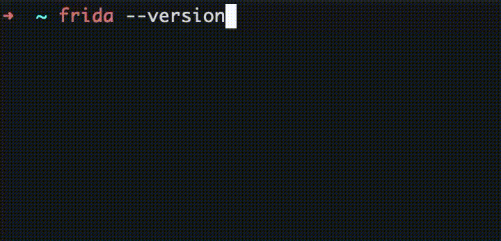

# frida-version-manager

Switch between multiple [Frida](https://frida.re) versions instantly.
One command activates — unknown versions are auto-created on first use.



```
frida-16.6.3   # activate frida 16.6.3  (creates it if needed)
frida-17.8.0   # switch to 17.8.0
frida-list     # see all environments
deactivate     # return to system shell
```

Each environment is an isolated Python venv with **frida**, **frida-tools**,
and **objection** pre-installed.

---

## Requirements

| Platform       | Requirements                          |
|----------------|---------------------------------------|
| macOS / Linux  | Python 3.8+, zsh or bash              |
| Windows        | Python 3.8+, PowerShell 5.1+          |

---

## Installation

### macOS / Linux

```bash
# 1. Clone the repo
git clone https://github.com/<your-username>/frida-version-manager.git ~/frida-manager

# 2. Run the installer (auto-detects your shell and config file)
cd ~/frida-manager
bash install.sh

# 3. Reload your shell
source ~/.zshrc       # zsh  (macOS default)
# or
source ~/.bashrc      # bash (Linux default)
```

<details>
<summary>Manual setup (no installer)</summary>

Add these two lines to your `~/.zshrc` or `~/.bashrc`:

```bash
export FRIDA_HOME="$HOME/.frida-envs"
source "$HOME/frida-manager/frida-env.sh"
```

Then reload: `source ~/.zshrc`
</details>

---

### Windows

```powershell
# 1. Clone the repo
git clone https://github.com/<your-username>/frida-version-manager.git $HOME\frida-manager

# 2. Allow local scripts (one-time, if not already done)
Set-ExecutionPolicy -Scope CurrentUser -ExecutionPolicy RemoteSigned

# 3. Run the installer
cd $HOME\frida-manager
.\install.ps1

# 4. Reload your profile
. $PROFILE
```

<details>
<summary>Manual setup (no installer)</summary>

Add these two lines to your `$PROFILE` (`notepad $PROFILE`):

```powershell
$env:FRIDA_HOME = "$HOME\.frida-envs"
. "$HOME\frida-manager\frida-env.ps1"
```

Then reload: `. $PROFILE`
</details>

---

## Usage

```bash
# Activate a version (creates it automatically on first use)
frida-16.6.3
frida-17.8.0
frida-17.8.2

# List all environments
frida-list

# Check the active version
frida --version

# Deactivate
deactivate
```

When you type a version that does not exist yet, the manager will:

1. Create a fresh Python venv at `$FRIDA_HOME/frida_X.Y.Z/.venv`
2. Install `frida==X.Y.Z`, `frida-tools`, and `objection`
3. Activate the environment — ready to use immediately

---

## Configuration

| Variable      | Default           | Description                              |
|---------------|-------------------|------------------------------------------|
| `FRIDA_HOME`  | `~/.frida-envs`   | Directory where all venvs are stored     |

Override **before** the `source` line in your shell config:

```bash
export FRIDA_HOME="/custom/path/frida-envs"
source "$HOME/frida-manager/frida-env.sh"
```

---

## Updating

```bash
cd ~/frida-manager && git pull
```

No reinstall needed — your shell config sources the repo directly.

---

## How it works

| Mechanism | Details |
|---|---|
| Startup scan | At shell startup, all `$FRIDA_HOME/frida_*/` dirs are registered as live shell functions (`frida-16.6.3`, etc.) |
| Auto-create | The shell's **command-not-found handler** intercepts `frida-X.Y.Z` calls for unknown versions, creates the venv, installs packages, and activates |
| Instant availability | After activation `rehash` (zsh) / `hash -r` (bash) flushes the command cache — `frida`, `objection`, etc. are usable immediately without opening a new terminal |

---

## Repo structure

```
frida-version-manager/
├── frida-env.sh     # bash + zsh version manager (macOS / Linux)
├── frida-env.ps1    # PowerShell version manager (Windows)
├── install.sh       # one-shot installer for macOS / Linux
├── install.ps1      # one-shot installer for Windows
└── README.md
```

---

## License

MIT
